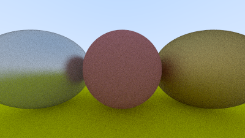

# rt_py

A python port of the C++ code from the book ["Raytracing in One Weekend"](https://raytracing.github.io/books/RayTracingInOneWeekend.html) by [Peter Shirley](https://github.com/petershirley)

## Final Image


## Current Image




## Installation

```bash
git clone https://github.com/alok1974/rt_py
cd rt_py
python3 -m venv .venv
source .venv/bin/activate
python -m pip install --upgrade pip
python -m pip install .
```

## Render

```bash
render -o <output image path, for example, ~/image.png>
```
